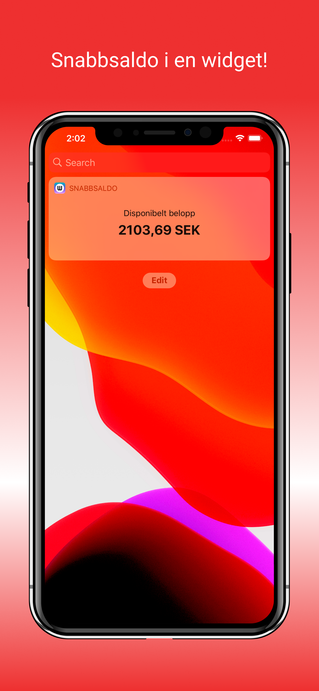
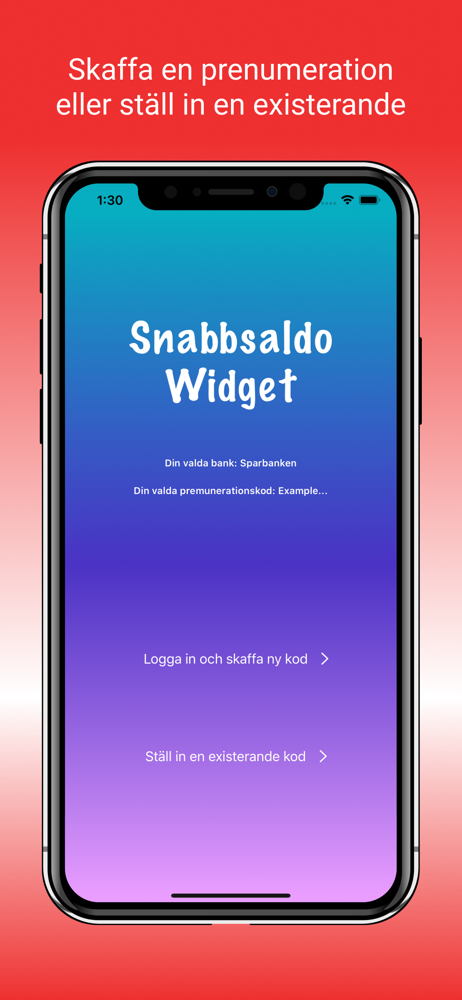
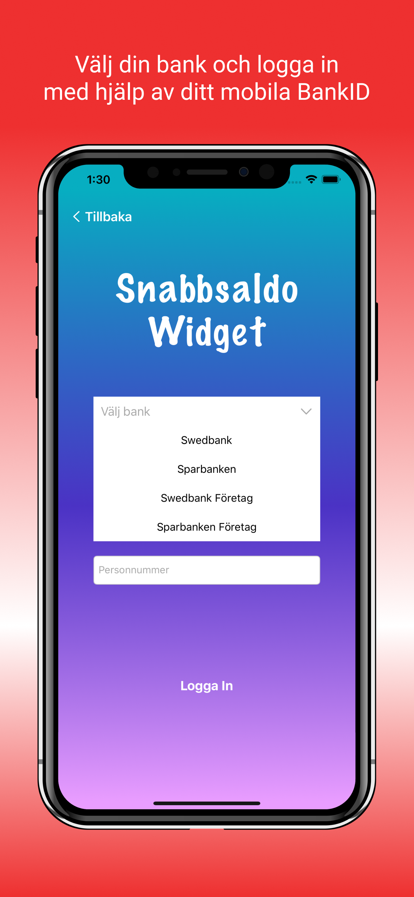
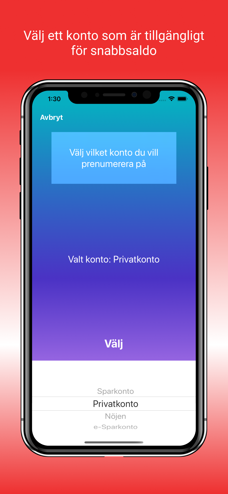

# Swedbank Widget

Detta är en inofficiell app för att hämta ditt snabbsaldo från ett förvalt Swedbank/Sparbanken konto.
Appen använder "Swedbank's Mobile Apps API" som är samma API som de svenska Swedbank/Sparbanken apparna använder.

Appen är endast tillgänglig på iOS och finns att laddar ner som IPA fil via detta repo.

## Screenshshots

   

## Disclaimer

Detta är mitt första stora programmeringsprojekt och även mitt första projekt överlag med swift
som programmeringsspråk och Xcode som IDE. Ha gärna detta i åtanke.
Tveka dock inte på att ge kritik och förslag på förbättringar! Appen är baserad på idén bakom walle89's projekt kallat
"SwedbankJson", detta projekt hittar ni [här](https://github.com/walle89/SwedbankJson).

## Kontakt

Email: samuelivarsson3(at)gmail(dot)com
